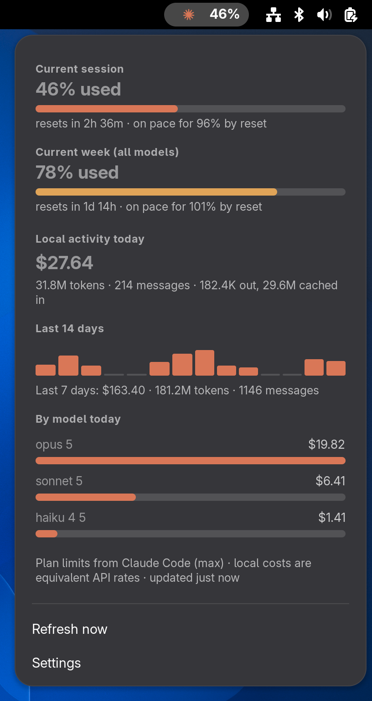

# Claude Usage — GNOME Shell extension

A top-bar indicator for your Claude plan limits: how much of your 5-hour
session and weekly windows you've used, when they reset, where you're on pace
to finish, and a local breakdown of what you've spent it on.

<p align="center">
  
</p>

Requires GNOME Shell 48–50 and Claude Code signed in with a Claude subscription
(Pro, Max, Team or Enterprise).

## Install

```sh
git clone https://github.com/Tom0Brien/gnome-claude-usage.git
cd gnome-claude-usage
./install.sh
```

Log out and back in (on X11, <kbd>Alt</kbd>+<kbd>F2</kbd>, `r` is enough), then
check it with `gnome-extensions info claude-usage@tobrien.local`.

If the shell can't find `claude`, set `CLAUDE_USAGE_BIN` in your session
environment. `~/.local/bin`, `~/.claude/local`, `/usr/local/bin` and `/usr/bin`
are searched too.

## What it shows

- **Plan limits**: the same numbers as `/usage` in Claude Code. You get the
  current session, the current week, and any per-model or extra-usage windows
  on your plan. Bars turn amber at 75% and red at 100%.
- **Local activity**: today's equivalent API cost, token and message counts,
  a 14-day sparkline, and today's top five by model or project. These come from
  the transcripts in `~/.claude/projects`.

If plan limits aren't available (API key, Bedrock/Vertex, or no `claude`), the
drop-down says why and the panel shows today's local cost instead.

## Settings

Open with `gnome-extensions prefs claude-usage@tobrien.local`.

| Setting | Default | |
| --- | --- | --- |
| Display | Session used (%) | Weekly %, 5-hour block cost, today's cost, icon only |
| Position | Right | Left, centre or right |
| Refresh interval | 60 s | Opening the menu always fetches fresh numbers |
| Break down by project | Off | Per project instead of per model |
| Theme | Claude | 21 built-in themes (Catppuccin, Dracula, Nord, Gruvbox, …) or Custom |
| Theme the drop-down background | On | Off keeps the shell's menu colours |

Changing any colour saves a **Custom** theme. You can also set one from the
command line; colours you leave out come from Claude Dark:

```sh
schemas=~/.local/share/gnome-shell/extensions/claude-usage@tobrien.local/schemas
gsettings --schemadir $schemas set org.gnome.shell.extensions.claude-usage \
  custom-theme "{'accent': '#50c878', 'background': '#141e3c', 'text': '#f0f0f0'}"
gsettings --schemadir $schemas set org.gnome.shell.extensions.claude-usage theme custom
```

## How it works

Claude Code answers an experimental `get_usage` control request with the data
behind `/usage`. This makes no model request, costs no tokens, and reuses the
CLI's own sign-in:

```sh
printf '%s\n' '{"type":"control_request","request_id":"1","request":{"subtype":"get_usage"}}' \
  | claude --input-format stream-json --output-format stream-json --verbose -p
```

Local costs use published API rates (`PRICES` in `scanner.js`). On a
subscription they measure consumption, not a bill.

## Development

| File | Role |
| --- | --- |
| `extension.js` | Panel button, drop-down, refresh timer |
| `scanner.js` | Subprocess: fetches plan limits, parses transcripts, prints JSON |
| `prefs.js` | Preferences window |
| `themes.js` | Built-in themes and colour resolution |
| `stylesheet.css` | Menu layout and fallback colours |

The scanner caches per-transcript results in `~/.cache/claude-usage/`. To see
its raw output, run it by hand:

```sh
gjs -m scanner.js --live-max-age=0 | python3 -m json.tool
```

To test changes without logging out, run a throwaway shell:
`dbus-run-session -- gnome-shell --headless --virtual-monitor 1400x900 --wayland`.
